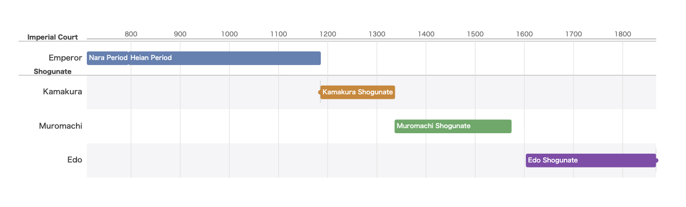
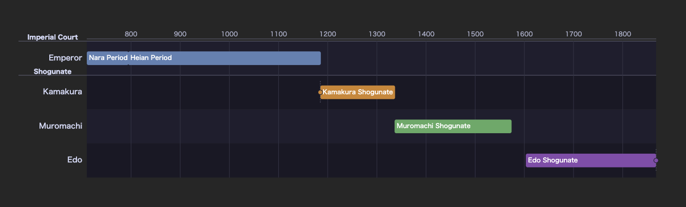

# obsidian-tdsl

[](https://github.com/keroway/obsidian-tdsl/actions/workflows/ci.yml)
[](./LICENSE)
[](https://www.npmjs.com/package/@keroway/tdsl-wasm)
[](https://github.com/keroway/timeline-dsl)

[Timeline DSL](https://github.com/keroway/timeline-dsl) の `tdsl` コードブロックをライブプレビューで SVG 年表として描画する [Obsidian](https://obsidian.md) プラグイン。

> English: [README.md](./README.md)

## プレビュー





## 機能

- **SVG 年表プレビュー** — `tdsl` コードブロックを Obsidian のライブプレビュー / 閲覧ビューで直接 SVG として描画
- **インライン構文エラー表示** — パース・意味エラーを行番号・列番号つきでノート内に表示。エディタを離れずに確認可能
- **ダークモード対応** — Obsidian の `body.theme-dark` クラスに自動追従。Catppuccin 系ダーク配色に切り替わる
- **XSS 安全な SVG 挿入** — `DOMParser` で SVG をパースして `document.adoptNode` で挿入。`innerHTML` 未使用、スクリプト実行なし
- **モバイル対応** — デスクトップ・モバイル両対応（`isDesktopOnly: false`）
- **外部通信なし** — [Timeline DSL WASM](https://www.npmjs.com/package/@keroway/tdsl-wasm) レンダラはバンドル済み。描画時に外部リクエストなし

## 使い方

任意のノートに `tdsl` コードブロックを書くだけです:

````markdown
```tdsl
timeline "平安時代" {
  unit year;
  range 794..1185;
}

lane "天皇" as emperor {}

span emperor 781..806 "桓武天皇" {};
span emperor 806..809 "平城天皇" {};
span emperor 809..823 "嵯峨天皇" {};
```

> **構文の注意:** `timeline { … }` ブロック内の各プロパティは `;` で終わります。
> 範囲は `start..end`（`start to end` ではありません）。
> `span` / `event` / `event_range` は `{ … }` ブロックの後ろに `;` が必要です。
> `lane` / `group` 宣言には末尾の `;` を**付けません**。
````

### Obsidian で使える DSL 構文

#### `timeline` ブロック

タイトル・時間単位・表示範囲・カラーマッピングを宣言します。

```
timeline "中国王朝" {
    title "中国王朝";
    unit year;
    range -500..2000;
    color_map {
        dynasty: "#3366cc";
        war:     "#cc0000";
    }
}
```

`unit` には `year`（年）、`month`（月）、`day`（日）を指定できます。

#### `lane` 宣言

縦方向のカテゴリを定義します。`as` でスパン・イベント配置に使う内部 ID を指定します。

```
lane "漢" as han { kind dynasty; order 20; }
```

#### `group` ブロック

複数のレーンをグループ化して、ラベルと境界線を描画します。

```
group "古代中国" {
    lane "秦" as qin { kind dynasty; order 10; }
    lane "漢" as han { kind dynasty; order 20; }
}
```

#### `span` / `event` / `event_range`

レーンに配置する 3 種類の時間要素:

```
// 期間（start..end）— ブロックの後ろに ; が必要
span han -206..220 "漢王朝" { tags ["dynasty"]; };

// 点イベント
event han -209 "大沢郷の乱" {};

// 範囲イベント（戦争・災害など）
event_range han 184..204 "黄巾の乱" { tags ["war"]; };
```

#### 描画オプション（`//!` ディレクティブ）

Obsidian はコードブロックの本文しかレンダラに渡さないため、図ごとのオプションは
`//!` コメント行（コンパイラが無視する通常の DSL コメント）で指定します。
ブロック内のどこに書いても構いません:

```tdsl
//! scale: 3
//! grid: decade
//! events: on
timeline "Demo" { unit year; range 0..100; }
lane "Main" as main {}
span main 10..50 "ある時代" {};
```

| ディレクティブ | 値 | 効果 |
|---|---|---|
| `scale` | 正の数 または `fit` | 1 年あたりのピクセル数。大きいほど横に広がり読みやすい。`fit` はノート幅に縮小（横スクロールなし）。省略で自動 |
| `grid` | `none`, `decade`, `year`, `month` | グリッド線の密度 |
| `theme` | `default`, `dark`, `print`, `pastel` | 組み込みカラーテーマ |
| `events` | `on` / `off` | `event` / `event_range` のラベル表示 |
| `table` | `on` / `off` | データ表の併記 |
| `orientation` | `horizontal`, `vertical` | レイアウト方向 |

年表は本来のサイズで描画され、ノート幅より広い場合は縮小せず横スクロールします
（縮小するとラベルが読めなくなるため）。まばらな年表を広げたいときは数値の `scale`、
一覧性を優先してノート幅に収めたいときは `//! scale: fit` を使ってください（ラベルも一緒に縮小されます）。

#### 既定値（設定タブ）

**設定 → コミュニティプラグイン → Timeline DSL** で vault 全体の既定値を設定できます。
毎ブロックに同じディレクティブを書かずに済みます:

| 設定 | 値 | 既定 |
|---|---|---|
| 既定テーマ | `auto`, `default`, `dark`, `print`, `pastel` | `auto`（プラグイン CSS で Obsidian のライト/ダークに追従） |
| 既定グリッド | `none`, `decade`, `year`, `month` | `none` |
| 既定スケール | `auto` / `fit` / 正の数 | `auto` |
| イベントラベルを既定で表示 | on / off | off |

優先順位は **ブロック `//!` ディレクティブ > 設定の既定値 > 組み込み既定**。
変更は対象ノートを開き直すと反映されます。

### フルサンプル

```tdsl
timeline "日本史" {
    title "奈良〜江戸";
    unit year;
    range 710..1868;
    color_map {
        imperial: "#8b5cf6";
        military: "#ef4444";
    }
}

group "朝廷" {
    lane "天皇" as emperor { kind imperial; order 1; }
}

group "武家政権" {
    lane "鎌倉幕府" as kamakura { kind military; order 2; }
    lane "室町幕府" as muromachi { kind military; order 3; }
    lane "江戸幕府" as edo      { kind military; order 4; }
}

span emperor 710..794 "奈良時代" { tags ["imperial"]; };
span emperor 794..1185 "平安時代" { tags ["imperial"]; };

span kamakura  1185..1336 "鎌倉幕府" { tags ["military"]; };
span muromachi 1336..1573 "室町幕府" { tags ["military"]; };
span edo       1603..1868 "江戸幕府" { tags ["military"]; };

event kamakura 1185 "源頼朝、征夷大将軍就任" {};
event edo      1868 "明治維新" {};
```

## 制限事項

以下の [Timeline DSL](https://github.com/keroway/timeline-dsl) 機能はネットワークアクセスやサーバーサイド処理が必要なため、Obsidian 内では**非対応**です:

| 機能 | 理由 |
|---|---|
| `import wikidata` | ブラウザレンダラから Wikidata への HTTP リクエスト不可 |
| `map` ブロック | `import wikidata` の解決結果に依存 |
| `template` / `apply` 構文 | `import wikidata` の解決結果に依存 |

`import wikidata` を含む `tdsl` ブロックがある場合、プラグインは警告 notice を表示し、ソース内の静的アイテム（`span` / `event` / `event_range`）のみを描画します。

Wikidata 連携が必要な場合は、[tdsl CLI](https://github.com/keroway/timeline-dsl) または [WebUI](https://keroway.github.io/timeline-dsl/) で SVG / HTML に事前レンダリングしてください。

## インストール

### コミュニティプラグイン（近日公開予定）

現時点では Obsidian コミュニティプラグインディレクトリへの申請準備中です。公開後は **設定 → コミュニティプラグイン → 閲覧** で `Timeline DSL` を検索してインストールできるようになります。

### 手動インストール（GitHub Release）

1. [Releases ページ](https://github.com/keroway/obsidian-tdsl/releases) から最新リリースの以下 3 ファイルをダウンロード:
   - `main.js`
   - `manifest.json`
   - `styles.css`
2. Vault にプラグインディレクトリを作成（存在しない場合）:

   ```sh
   mkdir -p <vault>/.obsidian/plugins/timeline-dsl/
   ```

3. ダウンロードした 3 ファイルをそのディレクトリにコピー。
4. Obsidian で **設定 → コミュニティプラグイン → インストール済みプラグイン** から **Timeline DSL** を有効化

> Obsidian 1.4.0 以上が必要です。

### 手動インストール（開発ビルド）

1. このリポジトリをクローン
2. 依存関係をインストールしてビルド:

   ```sh
   npm install
   npm run build
   ```

3. 生成された 3 ファイルを Vault にコピー:

   ```sh
   # <vault> は自分の Vault のパスに置き換えてください
   cp main.js manifest.json styles.css <vault>/.obsidian/plugins/timeline-dsl/
   ```

4. Obsidian で **設定 → コミュニティプラグイン → インストール済みプラグイン** から **Timeline DSL** を有効化

> Obsidian 1.4.0 以上が必要です。

## 開発

```bash
npm install          # 依存関係のインストール
npm run dev          # ウォッチモード（保存時に自動リビルド）
npm run build        # プロダクションビルド → main.js
npm run lint         # ESLint（src/ を対象）
npm run typecheck    # tsc --noEmit
```

CI は lint → typecheck → build の順に実行し、`main.js` の生成を確認します。詳細は [CONTRIBUTING.md](./CONTRIBUTING.md) を参照してください。

## 関連プロジェクト

| プロジェクト | 説明 |
|---|---|
| [keroway/timeline-dsl](https://github.com/keroway/timeline-dsl) | Timeline DSL コンパイラ本体（Rust + WASM）。CLI / WebUI / GitHub Actions 対応 |
| [WebUI](https://keroway.github.io/timeline-dsl/) | ブラウザで動くリアルタイムエディタ。Wikidata 連携もフル対応 |
| [ランディングページ](https://timeline-dsl-lp.pages.dev/) | 機能紹介・概要 |
| [VS Code 拡張](https://marketplace.visualstudio.com/items?itemName=keroway.timeline-dsl) | `.tdsl` ファイルのシンタックスハイライト |
| [@keroway/tdsl-wasm](https://www.npmjs.com/package/@keroway/tdsl-wasm) | このプラグインが使用する WASM パッケージ |

## ライセンス

MIT © keroway

同梱依存のサードパーティライセンスは [THIRD-PARTY-NOTICES.md](./THIRD-PARTY-NOTICES.md) を参照してください。
